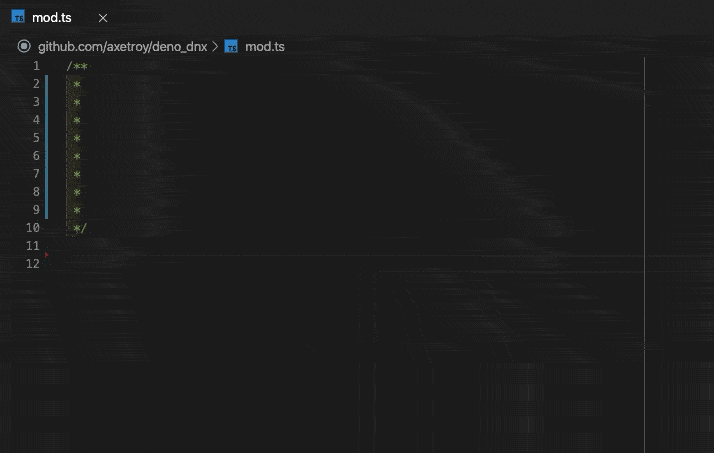
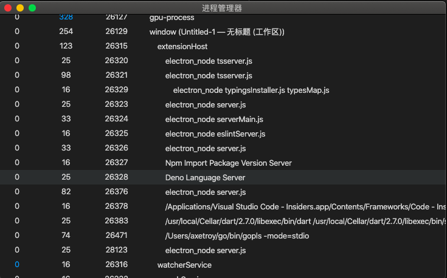

English | [中文简体](README_zh-CN.md)

<div align="center">

# Visual Studio Code Deno extension


[](https://coveralls.io/github/axetroy/vscode-deno?branch=refs/heads/master)
[](https://deepscan.io/dashboard#view=project&tid=6484&pid=9924&bid=132500)


Adds Deno support for the Visual Studio Code.


</div>

Features:

<details><summary>Full intellisense support</summary>


</details>

<details><summary>Intelligent module import</summary>



</details>

<details><summary>Supports importing ECMAScript modules</summary>


</details>

<details><summary>Diagnostics and quick fixes</summary>


</details>

<details><summary>Optional use of Deno's built in formatting</summary>


</details>

<details><summary>Client/Server model with LSP</summary>

The extension separates Client/Server with LSP

This means that complicated problems are handled on the server-side

The extension won't block your Visual Studio Code



</details>

<details><summary>Supports `Import Maps` for Deno</summary>


</details>

<details><summary>External type definitions</summary>

The extension supports the following ways to load external declaration files

> These are all supported by Deno

1. ~Compiler hint~

```ts
// @deno-types="./foo.d.ts"
import * as foo from "./foo.js";
```

> This will not be implemented in then extensions.

2. `Triple-slash` reference directive

```ts
/// <reference types="https://raw.githubusercontent.com/date-fns/date-fns/master/typings.d.ts" />

import { format } from "https://deno.land/x/date_fns/index.js";

format(new Date(), "yyyy/MM/DD");
```

3. `X-TypeScript-Types` custom header

```ts
import { array } from "https://cdn.pika.dev/fp-ts";

const M = array.getMonoid<number>();
console.log("concat Array", M.concat([1, 2], [2, 3]));
```

</details>

<details><summary>Deno version manager integration</summary>

Investigating integration into the extension

We recommend you using [dvm](https://github.com/axetroy/dvm) for the manager Deno version.

</details>

## Usage

1. Download and enable the extension from the [Visual Studio Marketplace](https://marketplace.visualstudio.com/items?itemName=axetroy.vscode-deno)

2. Enable Deno for your project:

   Create a file `.vscode/settings.json` in your project folder:

   ```json5
   // .vscode/settings.json
   {
     "deno.enable": true,
   }
   ```

3. Enjoy!

## Configuration

- `deno.enabled` - Enable extension. Default is `false`

- `deno.import_map` - The file paths of Import Map. Default is `null`

We recommend that you do not set global configuration. It should be configured in `.vscode/settings.json` in the project directory:

```json5
// .vscode/settings.json
{
  "deno.enable": true,
  "deno.import_map": "./path/to/import_map.json",
}
```

This extension also provides Deno's formatting tools, settings are in `.vscode/settings.json`:

```json5
// .vscode/settings.json
{
  "[typescript]": {
    "editor.defaultFormatter": "axetroy.vscode-deno",
  },
  "[typescriptreact]": {
    "editor.defaultFormatter": "axetroy.vscode-deno",
  },
}
```

## Contribute

Follow these steps to contribute, the community needs your strength.

1. Fork project

2. Clone onto your computer:

   ```bash
   $ git clone https://github.com/your_github_name/vscode-deno.git
   $ cd vscode-deno
   $ yarn # or npm install
   ```

3. Disable extension in Visual Studio Code if you have extension before

4. Start debug extension

   Open Visual Studio Code, find the `Run` item in the sidebar
   and then run `Launch Client` task.

   Wait for Visual Studio Code debugger to open a new window

5. Try updating Visual Studio Code and restart the debugger

6. Finally, push to your fork and send a PR

## Thanks

This project was originally a fork of [justjavac/vscode-deno](https://github.com/justjavac/vscode-deno), Thanks for their contributions.

## License

The [MIT License](LICENSE)
