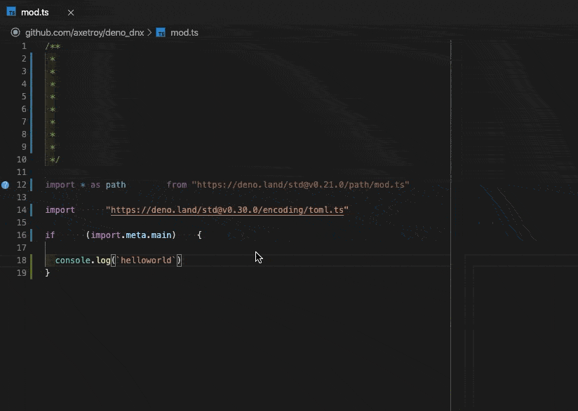

# VS Code Deno extension


Adds Deno support for vs code


Feature:

<details><summary>Support Deno declaration file</summary>


</details>

<details><summary>Module import intelligent</summary>


</details>

<details><summary>Diagnostics and quick fix</summary>


</details>

<details><summary>Deno formatting tool</summary>



</details>

<details><summary>C/S model with LSP</summary>

The extension separate Client/Server with LSP

This means that complicated problems are handled on the server side

Extension won't block your vscode


</details>

<details><summary>Support `Import Maps` for Deno</summary>


</details>

<details><summary>Deno version upgrade detection</summary>

TODO

</details>

<details><summary>Deno version manager</summary>

Investigating integration into extension

We recommend you using [dvm](https://github.com/axetroy/dvm) for manager Deno version.

</details>

## Usage

1. Download and enable extension from [vscode market](https://marketplace.visualstudio.com/items?itemName=axetroy.vscode-deno)

2. Enable Deno for your project

create a file `.vscode/setting.json` in your project folder

```json5
// .vscode/setting.json
{
  "deno.enable": true
}
```

3. Enjoy!

## Difference from [justjavac.vscode-deno](https://github.com/justjavac/vscode-deno)

- Almost completely rewritten
- Fix its known issues
- Add some new features
- Integrated [typescript-deno-plugin](typescript-deno-plugin) means easier maintenance

## Configuration

- `deno.enabled` - Enable extension. Default is `false`.

- `deno.dtsFilepaths` - The file paths of the TypeScript declaration file(.d.ts). Default is `[]`

- `deno.import_map` - The file paths of Import Map. Default is `null`

We recommend that you do not set global configuration. It should be configured in `.vscode/setting.json` in the project directory

```json5
// .vscode/setting.json
{
  "deno.enable": true,
  "deno.dtsFilepaths": ["./path/to/deno.d.ts"],
  "deno.import_map": "./path/to/import_map.json"
}
```

Extensions also provide Deno's formatting tools, setting in `.vscode/setting.json`

```json
{
  "[typescript]": {
    "editor.defaultFormatter": "axetroy.vscode-deno"
  },
  "[typescriptreact]": {
    "editor.defaultFormatter": "axetroy.vscode-deno"
  },
  "[javascript]": {
    "editor.defaultFormatter": "axetroy.vscode-deno"
  },
  "[javascriptreact]": {
    "editor.defaultFormatter": "axetroy.vscode-deno"
  },
  "[markdown]": {
    "editor.defaultFormatter": "axetroy.vscode-deno"
  },
  "[json]": {
    "editor.defaultFormatter": "axetroy.vscode-deno"
  }
}
```

To configure the format tool, create `.prettierrc.json` in the project directory

```json
{
  "semi": true,
  "singleQuote": false
}
```

If you want to ignore the directory/file. create `.prettieringore` in the project directory

## Commands

This extension contributes the following commands to the Command palette.

- `deno.enable` - Enable this extension.
- `deno.disable` - Disable this extension.
- `deno.restart_server` - Restart Deno Language Server.

## Contribute

1. Fork project

2. Clone into your computer

```bash
$ git clone https://github.com/your_github_name/vscode-deno.git
$ cd vscode-deno
$ yarn # or npm install
```

3. Disable extension in vs code if you have extension before

4. Start debug extension

> Open vs code and find the `Debug` item in the sidebar
>
> And then run `Launch Client` debugger.
>
> Wait for vs code debugger to open a new window

5. Try update code and restart debug

6. Finally, push to your fork and send a PR

## Thanks

This project was originally a fork of [justjavac/vscode-deno](https://github.com/justjavac/vscode-deno)

Thanks for their contributions

## License

The [MIT License](LICENSE)
